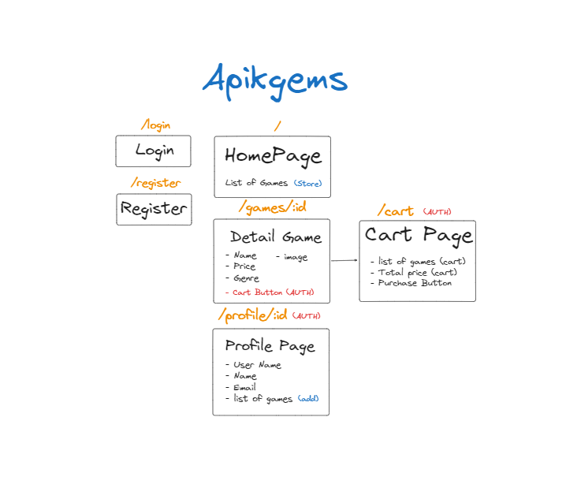

# Apikgems

## Week 22 Group Project Team H
> Apikgems is Game Launcher base in Indonesia, that gives the chance for indie indonesia game developer to deploy their game.

## Team

| Name           | Role                   |
| :------------- | :--------------------- |
| Indra Setiadhi | Software Engineer      |
| Gary Cruise    | Software Engineer      |

## Pages

- Login
- Register
- Home
- Store
- Detail Game
- Community
- Detail Community
- Profile
- Chat

## App Flow



## API

https://apikgems.cobainweb.site/docs

## Getting Started

First, run the development server:

```bash
npm run dev
# or
yarn dev
# or
pnpm dev
```

## Endpoints

**Authentication**

| Method | Endpoint             | Description         | Auth |
| :----- | :------------------- | :------------------ | ---- |
| 'POST' | '/api/auth/register' | Register a new user |      |
| 'POST' | '/api/auth/login'    | Login user          |      |

**Users**

| Method   | Endpoint              | Description              | Auth |
| :------- | :-------------------- | :----------------------- | ---- |
| 'GET'    | '/api/users'          | Get all users            |      |
| 'GET'    | '/api/users/{id}'     | Get user by id           |      |
| 'GET'    | '/api/users/me'       | Get my account           | 🔑   |
| 'PUT'    | '/api/users/me'       | Update my account        | 🔑   |
| 'DELETE' | '/api/users/me'       | Delete my account        | 🔑   |
| 'POST'   | '/api/users/me/games' | Add game to user account | 🔑   |

**Games**

| Method   | Endpoint          | Description       | Auth |
| :------- | :---------------- | :---------------- | ---- |
| 'GET'    | '/api/games       | Get all games     |      |
| 'GET'    | '/api/games/{id}' | Get game by id    |      |
| 'POST'   | '/api/games       | Create a game     | ⚿    |
| 'PUT'    | '/api/games/{id}' | Update game by id | ⚿    |
| 'DELETE' | '/api/games/{id}' | Delete game by id | ⚿    |